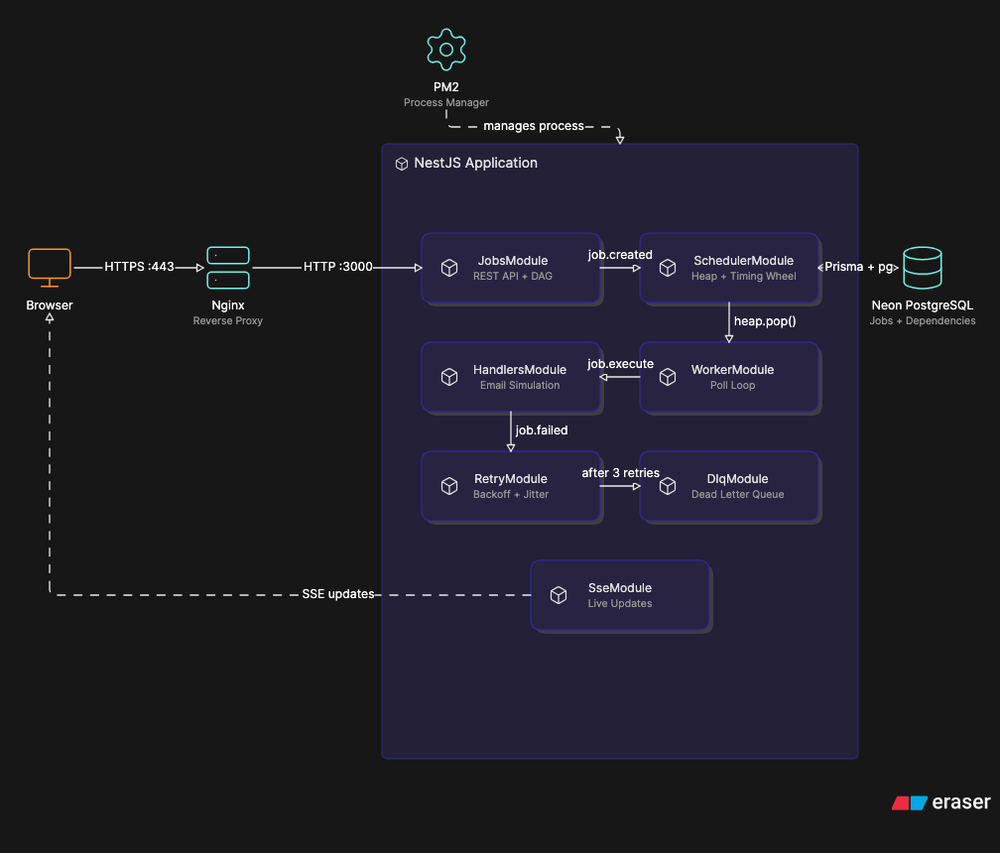

# Architecture — Job Scheduler

## Overview

The scheduler is a NestJS monolith with an embedded worker. The HTTP server and worker share the same process but operate independently — the API never waits for job execution.

HTTP Request → JobsService → PostgreSQL (Prisma)
↓
SchedulerService
(Min-Heap + Timing Wheel + Aging)
↓
WorkerService (setInterval)
↓
EmailHandler (job.execute event)
↓
RetryService / DlqService (on failure)
↓
SSE → UI (job.updated event)

## Modules

| Module | Responsibility |
|--------|---------------|
| `JobsModule` | CRUD, DAG dependency registration |
| `SchedulerModule` | Heap, timing wheel, starvation prevention |
| `WorkerModule` | Poll loop, job pickup, DAG unblocking |
| `HandlersModule` | Email simulation handler |
| `RetryModule` | Backoff, retry scheduling, DLQ admission |
| `DlqModule` | DLQ view, manual retry, threshold alerting |
| `SseModule` | Real-time event streaming to UI |
| `PrismaModule` | Global database client |
| `LoggerModule` | Global Pino structured logger |

## Heap-Based Priority Queue

**File:** `src/scheduler/heap.service.ts`

A binary min-heap. Jobs are ordered by three keys in sequence:

1. effectivePriority  (lower = higher priority; 1=High, 2=Medium, 3=Low)
2. scheduledAt        (earlier scheduled time wins)
3. createdAt          (earlier creation time wins as tiebreaker)

**Operations:**
- `push` — O(log n) insertion, bubbles up
- `pop` — O(log n) removal of min, bubbles down
- `remove(id)` — O(n) search + O(log n) heapify, used for safe job removal after DB lock
- `updatePriority` — O(n) update + O(log n) heapify, used by aging

**Why a heap?** Constant-time access to the highest-priority job. Insertion and removal are logarithmic — acceptable for the job volumes this system handles.

## Timing Wheel (Alternative Algorithm)

**File:** `src/scheduler/timing-wheel.service.ts`

A circular array of 60 buckets (one per second). A ticker advances one bucket per second. Jobs are placed into the bucket corresponding to their delay:

targetSlot = (currentSlot + floor(delayMs / 1000)) % 60

When the ticker reaches a bucket, all jobs in it are admitted to the heap.

**Operations:**
- `schedule` — O(1) bucket insertion
- `tick` — O(k) where k = jobs in current bucket

**Tradeoffs vs Heap:**

| | Heap | Timing Wheel |
|--|------|-------------|
| Insertion | O(log n) | O(1) |
| Dynamic priority | ✅ Native | ❌ Not supported |
| Fixed-interval recurring | ✅ Works | ✅ More natural |
| Resolution | Exact | 1-second granularity |

**Benchmark results (1000 jobs):**

Heap:         1.05ms
Timing Wheel: 7.76ms
Winner:       Heap (for mixed workloads)

The heap wins on insertion in this benchmark because the timing wheel has overhead computing bucket slots and checking for re-scheduling across rotations. The timing wheel's advantage is architectural — O(1) slot placement for recurring jobs at fixed intervals, no comparison needed.


## System Architecture



## DAG Workflow

**Files:** `prisma/schema.prisma`, `src/worker/worker.service.ts`

Jobs declare dependencies via the `JobDependency` join table:

Job A ──depends on──▶ Job B
Job A ──depends on──▶ Job C

Job A will not enter the heap until both B and C are `COMPLETED`.

**Flow:**
1. Job created with `dependsOn: [jobB.id, jobC.id]`
2. Worker skips Job A on startup bootstrap (deps not done)
3. When Job B completes → `job.completed` event fires
4. `WorkerService.onJobCompleted` checks all dependents of B
5. If all of A's dependencies are now `COMPLETED` → A is admitted to heap

**Example DAG:**

Generate Report → Upload File → Send Email

Create three jobs where each depends on the previous one's ID.

## Starvation Prevention

**File:** `src/scheduler/aging.service.ts`

A `@Cron` job runs every 30 seconds. It finds all `PENDING` jobs that have been waiting longer than `AGING_INTERVAL_SECONDS` (default: 30s) and reduces their `effectivePriority` by `AGING_BOOST_AMOUNT` (default: 0.5), down to a minimum of 1.

**Example:**

Low priority job (priority=3) waits 30s → effectivePriority becomes 2.5
Waits another 30s → effectivePriority becomes 2.0
Waits another 30s → effectivePriority becomes 1.5
Eventually competes with high-priority jobs

**Configuration:**

| Variable | Default | Meaning |
|----------|---------|---------|
| `AGING_INTERVAL_SECONDS` | `30` | Wait time before boost applies |
| `AGING_BOOST_AMOUNT` | `0.5` | Priority reduction per cycle |

## Retry Policy

**File:** `src/retry/retry.service.ts`

Failed jobs retry up to 3 times with exponential backoff and jitter:

Attempt 1 → base: 1s   + jitter(0-500ms)  ≈ ~1s
Attempt 2 → base: 5s   + jitter(0-500ms)  ≈ ~5s
Attempt 3 → base: 25s  + jitter(0-500ms)  ≈ ~25s

Formula: `base = 5^(attempt-1) * 1000ms`

After 3 failed attempts the job is marked `FAILED` and `isDlq=true`.

## Dead Letter Queue

**File:** `src/dlq/dlq.service.ts`

Jobs in the DLQ have `isDlq=true`. They are excluded from normal job queries.

**Threshold alert:** When DLQ count reaches `DLQ_ALERT_THRESHOLD` (default: 10), a mock alert email is logged. In production this would call an email provider.

**Manual retry:** Resets `retryCount=0`, `isDlq=false`, `status=PENDING` and re-admits to the scheduler. If it fails again, it returns to the DLQ.

## Duplicate Protection

**File:** `src/worker/worker.service.ts`

Uses an atomic `updateMany` as a compare-and-swap:

```sql
UPDATE jobs SET status = 'PROCESSING'
WHERE id = $1 AND status = 'PENDING'
```

Only one worker can update a row from `PENDING` to `PROCESSING`. If `count === 0`, the job was already taken or cancelled — the worker discards it from the heap and moves on.

## Cancellation Semantics

- `PENDING` jobs — cancelled immediately, never enter the heap
- `PROCESSING` jobs — status set to `CANCELLED` in DB; the running handler re-checks status before marking `COMPLETED` and aborts if cancelled

This is documented here because cancelling an in-flight job is a race condition by nature. The handler checks once after the simulated work completes — meaning work may still execute but the status will not advance to `COMPLETED`.

## SSE Live Updates

**File:** `src/sse/sse.controller.ts`

Uses NestJS `@Sse` decorator with an RxJS `Subject`. Any `job.updated` event emitted anywhere in the system pushes to all connected SSE clients. The UI patches the job row in place and refreshes dashboard counts.

Reconnects automatically on error with a 3-second delay.

## Logging

All significant events are logged in structured format via Pino:

| Event | Logger | Fields |
|-------|--------|--------|
| Job created | JobsService | id, type, priority |
| Job admitted | WorkerService | id, type, priority |
| Job started | WorkerService | id, type, priority |
| Job completed | EmailHandler | id |
| Job failed | EmailHandler | id, error |
| Retry scheduled | RetryService | id, attempt, backoffMs |
| Job moved to DLQ | DlqService | id, type, error |
| Job cancelled | JobsService | id |
| DAG unblocked | WorkerService | id, type |
| Aging applied | AgingService | id, oldPriority, newPriority |

## Database Schema

Job
├── id (uuid, PK)
├── type (string)
├── payload (Json)
├── priority (1|2|3)
├── status (PENDING|PROCESSING|COMPLETED|FAILED|CANCELLED)
├── retryCount (int)
├── scheduledAt (DateTime?)
├── interval (string?)
├── nextRunAt (DateTime?)
├── errorMessage (string?)
├── isDlq (boolean)
├── effectivePriority (float)
├── createdAt (DateTime)
└── updatedAt (DateTime)
JobDependency
├── id (uuid, PK)
├── jobId (FK → Job)
└── dependsOnId (FK → Job)

## Deployment

- **VPS** — Ubuntu 24.04
- **Reverse proxy** — Nginx
- **Process manager** — PM2
- **Domain** — DuckDNS dynamic DNS
- **TLS** — Let's Encrypt via Certbot
- **Database** — Neon PostgreSQL (cloud)

### Nginx Config

```nginx
server {
    listen 80;
    server_name your-domain.duckdns.org;
    return 301 https://$host$request_uri;
}

server {
    listen 443 ssl;
    server_name your-domain.duckdns.org;

    ssl_certificate /etc/letsencrypt/live/your-domain.duckdns.org/fullchain.pem;
    ssl_certificate_key /etc/letsencrypt/live/your-domain.duckdns.org/privkey.pem;

    location / {
        proxy_pass http://localhost:3000;
        proxy_http_version 1.1;
        proxy_set_header Upgrade $http_upgrade;
        proxy_set_header Connection 'upgrade';
        proxy_set_header Host $host;
        proxy_cache_bypass $http_upgrade;

        # Required for SSE
        proxy_set_header X-Accel-Buffering no;
        proxy_buffering off;
        proxy_read_timeout 86400;
    }
}
```